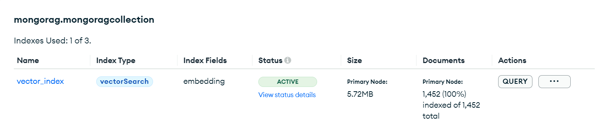

# RAG_with_Google_Gemma_and_MongoDB


To store this parameter in MongoDB Atlas:
```bash
{
    "fields":[{
        "numDimensions":1024,
        "path":"embedding",
        "similarity":"cosine",
        "type":"vector"
    }]
}
```
```
You need to go to Atlas search in MongoDB and create the search index and put the above snippet over there. Also select the database and collection name in the left hand side.
```

The Vector index assigned:

